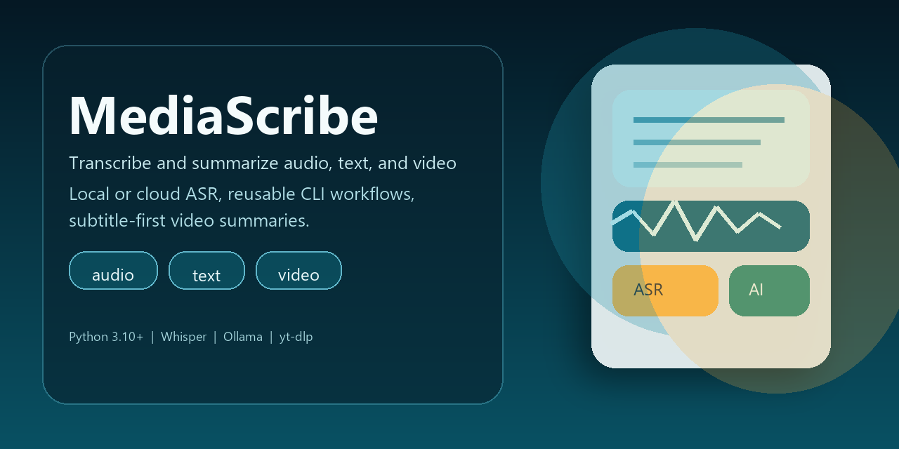

# MediaScribe

Language: **English** | [Chinese](README.zh-CN.md)

[](https://github.com/denven/mediascribe/releases)
[](https://github.com/denven/mediascribe/actions/workflows/ci.yml)




MediaScribe is a practical CLI for transcribing and summarizing audio, text, and video with reusable staged workflows.

## Highlights
- One tool for audio transcription, transcript summary, text summary, and video summary
- Reusable staged workflow: transcript first, summary later; or run everything end to end
- Local and cloud ASR support with provider-based architecture
- Video pipeline supports subtitle-first summary, ASR fallback, and audio-only extraction
- Output keeps source metadata such as original file paths and remote URLs
- Summary and transcription logic are abstracted as standalone services for reuse in other Python scripts

## Why MediaScribe

MediaScribe is designed around separation of concerns:
- transcription is a standalone service
- summary is a standalone service
- video is an orchestration layer that prefers subtitles, then falls back to audio extraction + ASR + summary
- provider adapters keep cloud and local implementations isolated and easy to reuse elsewhere

## Command Names

Preferred command names
- `mediascribe`
- `mediascribe-transcriber`
- `mediascribe-text`

## Architecture Snapshot

```text
mediascribe
  -> transcription_service / audio_summary_service / text_summary_service / video_summary_service
    -> scanner / subtitle_fetch_service / media_extract_service / video_input_service
      -> asr providers (local / azure / aliyun / iflytek)
      -> summary providers (litellm-backed model routing)
      -> ffmpeg / yt-dlp
```

```text
Audio
  -> transcript
  -> optional summary

Text
  -> summary

Video
  -> subtitles first
  -> or extract/download audio
  -> transcript
  -> summary
```

## Install

Recommended with `uv`

```bash
# Windows PowerShell
powershell -ExecutionPolicy ByPass -c "irm https://astral.sh/uv/install.ps1 | iex"

# macOS / Linux
curl -LsSf https://astral.sh/uv/install.sh | sh
```

Create the environment

```bash
uv venv --python 3.11
```

For local summary generation, install Ollama and pull the default model:

```bash
ollama pull qwen2.5:3b
```

Install by scenario

```bash
# Cloud ASR + summary
uv sync

# Add remote video support (yt-dlp)
uv sync --extra video

# Add local ASR
uv sync --extra local

# Local ASR + remote video
uv sync --extra local --extra video

# Development
uv sync --extra local --extra dev
```

## Minimal `.env`

```env
# Local ASR (usually needed for local diarization)
HF_TOKEN=hf_xxx

# Local summary model via Ollama
# These are also the built-in defaults.
MEDIASCRIBE_LLM_MODEL=ollama/qwen2.5:3b
MEDIASCRIBE_LLM_API_BASE=http://localhost:11434

# Azure ASR
AZURE_SPEECH_KEY=xxx
AZURE_SPEECH_REGION=westus2

# Optional cloud summary keys
# ANTHROPIC_API_KEY=sk-xxx
# GEMINI_API_KEY=xxx
# DEEPSEEK_API_KEY=xxx
```

Remote video auth examples

```env
YTDLP_COOKIES_FILE=.\cookies\global.txt
YTDLP_COOKIES_FROM_BROWSER=chrome:Profile 12
YTDLP_SITE_COOKIE_MAP=bilibili.com=.\cookies\bilibili_profile12.txt
```

See `.env.example` for a fuller template

## Local Summary Configuration

MediaScribe now defaults to a local summary model:
- model: `ollama/qwen2.5:3b`
- API base: `http://localhost:11434`
- status: manually verified end to end through the current MediaScribe summary flow

You can override that in either place:

```env
MEDIASCRIBE_LLM_MODEL=ollama/llama3.2:3b
MEDIASCRIBE_LLM_API_BASE=http://localhost:11434
```

```bash
uv run mediascribe-text .\notes --llm-model ollama/qwen2.5:3b --llm-api-base http://localhost:11434
```

If you want a cloud model instead, pass `--llm-model` and provide the matching API key in `.env`.

Manual integration check:

```bash
uv run python scripts/manual_check_ollama_summary.py
```

## Quick Start

### Audio: transcript + summary

```bash
uv run mediascribe ".\meeting.wav" --asr azure
```

### Audio: transcript only

```bash
uv run mediascribe ".\meeting.wav" --asr azure --no-summary
```

### Audio directory

```bash
uv run mediascribe .\audios --asr azure -o .\output
```

### Existing transcripts: summary only

```bash
uv run mediascribe .\output --summary-only
```

### Text or notes directory

```bash
uv run mediascribe-text .\notes
```

### Text summary with explicit local model override

```bash
uv run mediascribe-text .\notes --llm-model ollama/qwen2.5:3b --llm-api-base http://localhost:11434
```

### Local video summary

```bash
uv run mediascribe video ".\lesson.mp4" --asr azure
```

### Remote video summary

```bash
uv run mediascribe video "https://www.youtube.com/watch?v=aircAruvnKk"
```

## Typical Workflows

### 1. One-shot audio flow

```bash
uv run mediascribe ".\meeting.wav" --asr azure
```

### 2. Transcript first, summary later

```bash
uv run mediascribe ".\meeting.wav" --asr azure --no-summary -o .\output
uv run mediascribe .\output --summary-only
```

### 3. Summarize raw text from another script

```python
from pathlib import Path

from mediascribe.text_summary_service import summarize_raw_text_to_file

summary_path = summarize_raw_text_to_file(
    "Long text to summarize",
    output_dir=Path("manual_output"),
    source_name="manual-note",
    llm_model="ollama/qwen2.5:3b",
    llm_api_base="http://localhost:11434",
)

print(summary_path)
```

### 4. Video summary with subtitle-first strategy

```bash
uv run mediascribe video ".\lesson.mp4" --asr azure
```

Default video strategy

1. try subtitles first
2. if no usable subtitles, extract or download audio
3. run ASR if needed
4. generate summary

### 5. Video -> audio only -> audio summary later

```bash
uv run mediascribe video ".\lesson.mp4" --extract-audio-only -o .\output
uv run mediascribe ".\output\media\lesson.wav" --asr azure
```

### 6. Speaker naming

```bash
uv run mediascribe ".\meeting.wav" --speaker-name Alice --speaker-name Bob
```

Video ASR path

```bash
uv run mediascribe video ".\lesson.mp4" --force-asr --asr azure --speaker-name Alice --speaker-name Bob
```

## Hardware and Cost Notes

### Local ASR (`--asr local`)
- Uses significantly more local CPU / GPU / RAM
- Better when you prefer local processing and can accept heavier hardware usage
- For long media or weaker machines, cloud ASR is often the more practical path

### Cloud ASR (`--asr azure` / `aliyun` / `iflytek`)
- Reduces local hardware usage
- Usually handles long recordings more comfortably
- May incur cloud ASR cost

### Summary generation
- Default path uses a local Ollama model: `ollama/qwen2.5:3b`
- Default local endpoint is `http://localhost:11434`
- Cloud models are still supported through `--llm-model` plus the matching API key
- If you only want transcripts, use `--no-summary`

## Video Notes and Auth

### Supported video inputs
- local video files
- remote URLs such as YouTube, Bilibili, and other yt-dlp-supported sources

### Authentication order

When cookies are configured, MediaScribe tries

1. site-specific cookie file
2. global cookie file
3. browser profile cookies
4. unauthenticated request

Inspect the auth resolution path with

```bash
uv run mediascribe doctor-video-auth "https://www.bilibili.com/video/BV1VtcYzTEZn/"
```

### Azure long audio behavior

For Azure fast transcription, MediaScribe auto-splits risky inputs before upload:
- auto-split when duration is over 60 minutes
- auto-split when file size is over 150 MB
- default chunk size is 30 minutes

## Performance Reference

These are practical end-to-end timing references gathered during real runs on the current machine and network environment.

| Scenario | Input Duration | Method | End-to-End Time | Approx Speed |
| --- | ---: | --- | ---: | ---: |
| Local MP4 `cleaned_...mp4` | 6m06s | local video -> extract audio -> Azure ASR -> cloud summary | 1m41s | about 3.6x realtime |
| YouTube `3DlXq9nsQOE` | 18m30s | remote video -> download audio -> Azure ASR -> cloud summary | 2m26s | about 7.6x realtime |
| YouTube `aircAruvnKk` with subtitles | 18m26s | remote subtitles -> cloud summary | 31s | about 35.9x realtime |
| Facebook `1ahSKdqfDU` | 19s | remote video -> download audio -> Azure ASR -> cloud summary | 36s | about 0.5x realtime |
| Bilibili `BV1VtcYzTEZn` | 2m59s | subtitle fail -> audio fallback -> Azure ASR -> cloud summary | 58s to 1m04s | about 2.8x to 3.1x realtime |

More details

## Project Layout

```text
mediascribe/
  cli.py
  transcription_service.py
  text_summary_service.py
  video_summary_service.py
  asr/
  summary/
  ffmpeg_utils.py
  yt_dlp_auth.py

docs/
examples/
```

Note
- The public project name is `MediaScribe`
- The canonical Python package path is `mediascribe`

## Documentation Map
- Quick start: `docs/quickstart.md`
- Local workspace: `docs/local-workspace.md`
- Architecture: `docs/architecture.md`
- ASR API and extension guide: `docs/asr.md`
- Summary API and extension guide: `docs/summary.md`
- Third-party provider integration: `docs/plugin-providers.md`
- Benchmark notes: `docs/benchmark-notes.md`
- Custom provider examples: `examples/custom_providers/README.md`

## License

This project is licensed under the MIT License. See `LICENSE`.

## Release Notes

See `CHANGELOG.md` for release notes.

## Local Model Hardware Reference

These are practical starting points, not hard limits. Real usage varies with audio length, concurrency, device type, and whether CPU/GPU memory is shared.

### Local speech transcription
| Model / feature | GPU path | CPU path | Notes |
| --- | --- | --- | --- |
| `Whisper small` | Around `2 GB VRAM` | Roughly `8 GB RAM` | Good for lower-spec machines |
| `Whisper medium` | Around `5 GB VRAM` | Roughly `16 GB RAM` | Current default and a solid balance |
| `Whisper turbo` | Around `6 GB VRAM` | Roughly `16 GB RAM` | Faster, but still fairly heavy |
| `Whisper large` | Around `10 GB VRAM` | Roughly `16-32 GB RAM` | Best quality, highest local cost |
| `pyannote.audio` diarization add-on | Extra GPU headroom recommended | More comfortable on `16 GB RAM+` | Adds noticeable load on top of local ASR |

### Local text summary
| Model | Download size | CPU path | GPU path | Notes |
| --- | --- | --- | --- | --- |
| `ollama/qwen2.5:3b` | About `1.9 GB` | `6-8 GB RAM` | `4-6 GB VRAM` | Recommended default for Chinese-friendly summaries |
| `ollama/llama3.2:1b` | About `1.3 GB` | `4-6 GB RAM` | `2-3 GB VRAM` | Smallest practical option |
| `ollama/llama3.2:3b` | About `2.0 GB` | `6-8 GB RAM` | `4-6 GB VRAM` | Good general-purpose fallback |
| `ollama/phi4-mini` | About `2.5 GB` | `8 GB RAM` | `4-6 GB VRAM` | Useful when you want stronger structured output |

### Whole-machine suggestions
| Hardware budget | Suggested setup | Notes |
| --- | --- | --- |
| `8 GB RAM` | `Whisper small` + `llama3.2:1b` | Or use cloud ASR to reduce local load |
| `16 GB RAM` | `Whisper medium` + `qwen2.5:3b` | Most practical balanced setup |
| `32 GB RAM` or `8-12 GB VRAM` | Stronger Whisper variants plus local diarization | More comfortable for long local runs |
